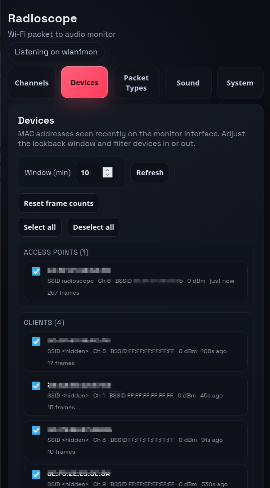
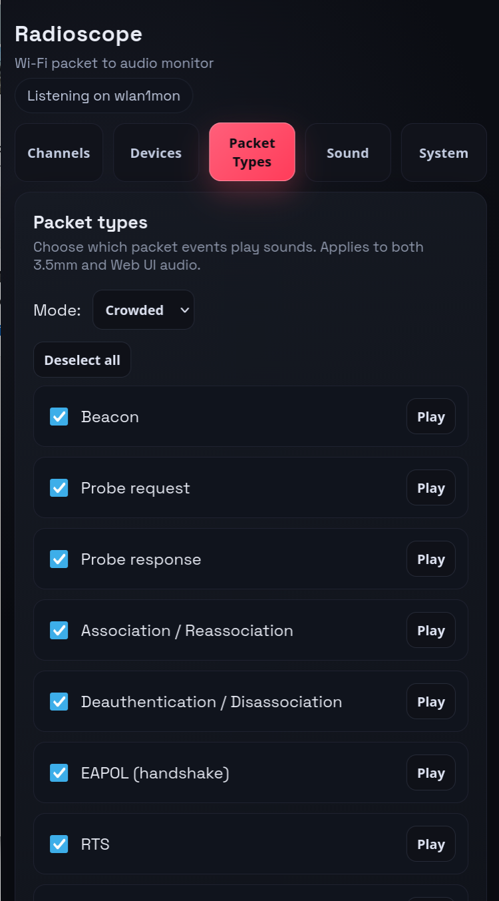
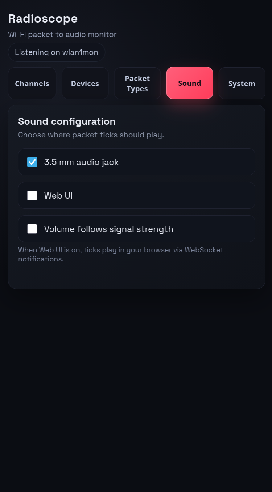
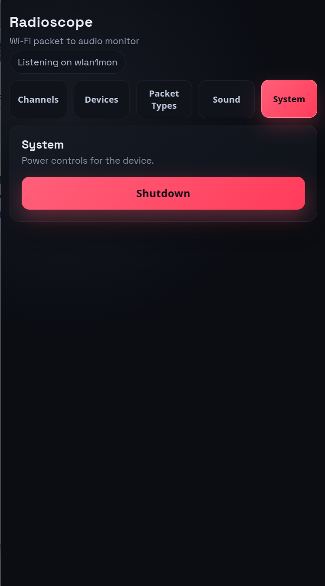

# Radioscope

Radioscope is a Rust service that turns Wi-Fi traffic into audible cues so you can “hear” the airwaves. It inspects packets from a monitor-mode interface and emits different synthesized sounds for different packet types, letting you distinguish beacons, data bursts, and management chatter without staring at a screen. You can aim a directional antenna to hunt for specific emitters or to map coverage while listening.

A built-in web UI is served over an access point hosted on the PI's built in wifi interface, so you can connect from a phone/laptop without relying on upstream networking. The UI lets you filter by device or packet type, start/stop playback, and adjust settings on the fly. Audio can be played locally through the Pi’s 3.5mm jack, or streamed through the UI for remote monitoring.

Under the hood it uses Dioxus SSR for the UI, Axum for the API, `libpcap` for capture, and `cpal`/ALSA for sound. A systemd unit handles startup on Raspberry Pi OS, and helper scripts configure the AP and monitor interface for you.

## Screenshots and Sample

<div style="display:grid;grid-template-columns:repeat(auto-fit,minmax(220px,1fr));gap:12px;">
  
  
  
  
  
</div>

<p>Sample audio:</p>
<audio controls preload="none" style="max-width:320px;">
  <source src="screenshots/sample.mp3" type="audio/mpeg">
  <a href="screenshots/sample.mp3">Download sample.mp3</a>.
</audio>

## Components

- Packet capture via `libpcap` (`pcap` crate).
- Audio tick synthesis via `cpal` (ALSA on the Pi).
- HTTP API and UI via `axum` + Dioxus SSR.
- systemd unit for autostart on Raspberry Pi OS (64-bit, aarch64).

## Hardware

- Raspberry Pi 4 (64-bit) or Pi 5 running Raspberry Pi OS.
- Built-in Wi-Fi on `wlan0` for the access point (hostapd + dnsmasq); keep it free from client connections while using the app.
- External USB Wi-Fi dongle that supports monitor mode, ideally dual-band 2.4/5 GHz; the setup script will name it `wlan1mon`.
- Audio output via the 3.5mm jack with speakers or headphones.
- Stable power and microSD sized for normal Pi OS installs.

## Configuration

Environment variables (defaults in parentheses):

- `MONITOR_INTERFACE` (`wlan1mon`) – monitor-mode Wi-Fi interface.
- `HTTP_BIND` (`0.0.0.0:8080`) – bind address for the UI/API.
- `TICK_FREQUENCY_HZ` (`880`) – tick sine frequency.
- `TICK_DURATION_MS` (`20`) – tick length.
- `TICK_VOLUME` (`0.35`) – tick amplitude.

## Local run

Install system deps: `libpcap` headers and ALSA (e.g., `sudo apt install libpcap-dev libasound2-dev`).

```
cargo run
```

## Cross-compiling for Raspberry Pi 4 (aarch64)

### Toolchain and deps (Ubuntu/Debian host)

1. Install cross toolchain + rsync:

```
sudo apt install gcc-aarch64-linux-gnu g++-aarch64-linux-gnu pkg-config rsync
```

2. Pull a Pi sysroot (one rsync; needs sudo locally to write under /opt):

```
export SYSROOT=/opt/pi-sysroot
sudo mkdir -p $SYSROOT
sudo rsync -a <pi-user>@<pi-ip>:/{lib,usr/lib,usr/include} $SYSROOT/
```

Ensure the sysroot contains `alsa.pc` at `$SYSROOT/usr/lib/aarch64-linux-gnu/pkgconfig/alsa.pc` and `pcap.pc`.

3. Install Rust target:

```
rustup target add aarch64-unknown-linux-gnu
```

### Build (cross)

Set pkg-config to use the Pi sysroot when cross-compiling:

```
export PKG_CONFIG=/usr/bin/pkg-config
export PKG_CONFIG_ALLOW_CROSS=1
export PKG_CONFIG_SYSROOT_DIR=/opt/pi-sysroot
export PKG_CONFIG_LIBDIR=/opt/pi-sysroot/usr/lib/aarch64-linux-gnu/pkgconfig
export PKG_CONFIG_PATH=/opt/pi-sysroot/usr/lib/aarch64-linux-gnu/pkgconfig
cargo build --release --target aarch64-unknown-linux-gnu
```

For native host builds, unset these `PKG_CONFIG_*` variables to avoid pointing at the Pi sysroot.

The repository provides `.cargo/config.toml` pointing to the `aarch64-linux-gnu-gcc` linker.

## Deploy to Pi

Assumes key-based SSH for `<pi-user>@<pi-ip>` and the Pi has `systemd` plus `shutdown` on PATH.

```
PI_USER=pi PI_HOST=192.168.1.50 ./scripts/deploy.sh
```

This copies the binary and `deploy/radioscope.service`, installs them to `/usr/local/bin` and `/etc/systemd/system`, reloads `systemd`, enables, and restarts the service.

## Service

`deploy/radioscope.service` runs the binary as `root` (needed for monitor mode and shutdown). Edit the `Environment=` lines to change interface or bind address before deploying if needed, then `systemctl daemon-reload && systemctl restart radioscope`.

## Notes

- The packet capture thread expects the interface to already be in monitor mode (e.g., `wlan1mon`). Adjust `MONITOR_INTERFACE` if you use a different name.
- Shutdown endpoint requires an explicit confirmation flag in the request body and the UI shows a confirm dialog.
- For cross-builds, pkg-config must see the Pi sysroot (`alsa.pc`, `pcap.pc`). Use the env vars above when cross-compiling; unset them for native builds.
- The monitor interface should be created by the setup script as `wlan1mon`; the sniffer opens it without forcing rfmon, so ensure the Wi‑Fi dongle is actually in monitor mode via the systemd unit.
